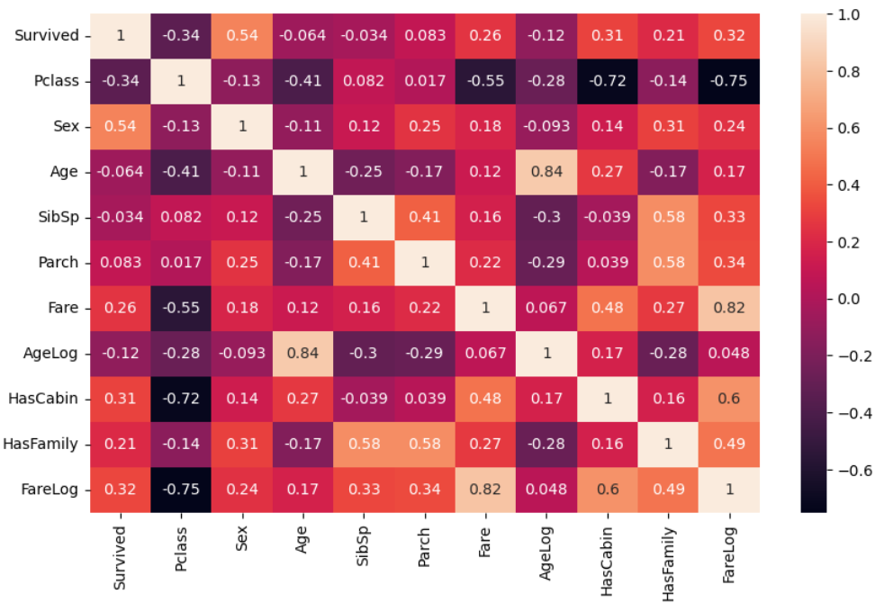

# Titani Sruvival Prediction

In this project I used machine learning to predict titanic survivals.

Experienced Machine Learning Models:
- Logistic Regression
- SGD Classifier
- SVR
- Decision Tree
- Random Forest
- Gaussian Naive Bayes (GaussianNB)

ML Model used to predict:
- Logistic Regression

Libraries & Tools:
- sklearn
- pandas
- numpy
- matplotlib
- seaborn
- pytest
- Jupyter Notebook -> EDA and prediction
- FastAPI
- Streamlit
- Docker

#### To Start just run:
- docker-compose up -d --build
after building just run:
- docker-compose up -d

#### To train and validate all experienced models:
- cd backend
- ensure train_all_models() for training and validate_all_models() for validation are not commented. Then: 
- python train_validate.py 

#### In order to plot experienced models:
- cd backend
- python plot_results.py -> saved in plots directory

#### To train one model (LogisticRegression):
- cd backend
- ensure train_model() for training is not commented. Then: 
- python train_validate.py 
- If you will to change the model you can select a model from model_scripts -> preprocessing

#### To predict:
- cd backend
- predict.py

#### In order to test backend using pytest
- docker-compose exec backend pytest .

# Results:

**metrics evaluation of training data:**
====================================================================================================
|      Model            |  accuracy   |   roc   | precision | recall | f1 score | Running time|
|  -------------------  | ----------  | ------- | --------  | ------ | -------- | ------------
|    LogisticRegression |   81.087    | 85.896  |   0.766   | 0.728  |   0.747  |   0.0627    |
|  -------------------  | ----------  | ------- | --------  | ------ | -------- | ------------
|    SGDClassifier      |  82.033     |   NaN   |   0.803   | 0.704  |   0.750  |   0.0261    |
|  -------------------  | ----------  | ------- | --------  | ------ | -------- | ------------
|    SVC                |  80.142     |   NaN   |   0.752   | 0.719  |   0.735  |   0.0502    |
|  -------------------  | ----------  | ------- | --------  | ------ | -------- | ------------
| DecisionTreeClassifier|  98.463     | 99.938  |   0.994   | 0.966  |   0.980  |   0.0362    |
|  -------------------  | ----------  | ------- | --------  | ------ | -------- | ------------
| RandomForestClassifier|  98.463     | 99.752  |   0.991   | 0.969  |   0.980  |   0.1557    |
|  -------------------  | ----------  | ------- | --------  | ------ | -------- | ------------
|    GaussianNB         |  75.296     | 82.442  |   0.665   | 0.716  |   0.689  |   0.0352    |

**metrics evaluation of validation data:**
====================================================================================================
|      Model             |  precision | recall  | f1 score | Running time   |
|  -------------------   | ---------- | ------- | -------- | -------------- |
|    LogisticRegression  |   81.250   |  72.222 |  76.471  |     0.0120     |
|  -------------------   | ---------- | ------- | -------- | -------------- |
|    SGDClassifier       |   91.667   |  61.111 |  73.333  |     0.0112     |
|  -------------------   | ---------- | ------- | -------- | -------------- |
|    SVC                 |   75.000   |  66.667 |  70.588  |     0.0125     |
|  -------------------   | ---------- | ------- | -------- | -------------- |
| DecisionTreeClassifier |   80.000   |  66.667 |  72.727  |     0.0106     |
|  -------------------   | ---------- | ------- | -------- | -------------- |
| RandomForestClassifier |   85.714   |  66.667 |  75.000  |     0.0166     |
|  -------------------   | ---------- | ------- | -------- | -------------- |
|    GaussianNB          |   61.538   |  44.444 |  51.613  |     0.0130     |

### Feature Engineering

As it has been shown, in this correlation plot, calculating Logs of Age and Fare (AgeLog, FareLog) are more correlated than their origins (Age, Fare). I also added HasCabin and HasFamily features.

- **AgeLog** -> Age
- **FareLog** -> Fare
- **HasCabin** -> Cabin
- **HasFamily** -> SibSp, Parch

#### Handling Null values
- **Pclass** : most frequency of grouping 'Sex' and 'HasCabin'
- **Age** : median of grouping 'Sex' and 'Pclass'
- **Fare** : mean
- **SibSp, Parch, HasFamily, Cabin, HasCabin** : 0
- **Sex, Embarked** : most frequent, OneHotEncoder

I also dropped **PassengerId**, **Name** and  **Ticket**.

### Metrics
- Accuracy
- ROC
- Precision
- Recall
- F1 Score